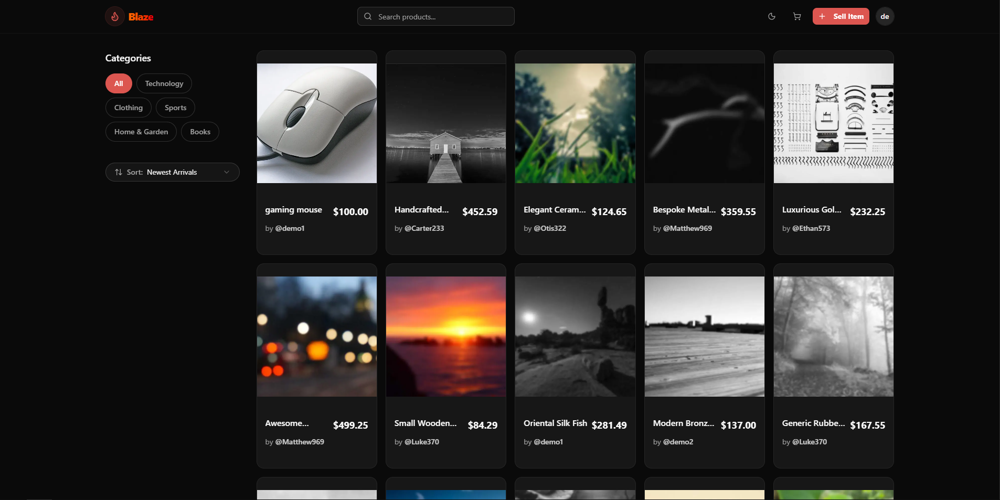

# 🔥 Blaze Marketplace

[](https://blaze-web-three.vercel.app/)
[](https://github.com/lautarocristiani/blaze-web)
[](LICENSE)

**Blaze** is a modern, secure, and scalable e-commerce marketplace built with the latest **Next.js 15** features. It allows users to browse products, manage their seller profiles, and process secure payments via Stripe.



---

## 🚀 Live Demo

Check out the live application running on Vercel:
👉 **[https://blaze-web-three.vercel.app/](https://blaze-web-three.vercel.app/)**

*Feel free to create an account and test the payment flow using Stripe Test Mode.*

---

## 🛠️ Tech Stack

Built with a focus on performance, type safety, and developer experience.

* **Core:**  
* **Styling:**  
* **Backend & DB:**  (PostgreSQL + Auth)
* **Payments:** 
* **Validation:** 

---

## ✨ Key Features

### 🛒 E-Commerce & Transactions
- **Stripe Integration:** Full checkout flow with **Webhooks** for secure order processing (handling success/cancel states server-side).
- **Cart System:** Persistent shopping cart management via Context API.
- **Order History:** Dashboard for buyers and sellers to track transactions.

### 🔐 Authentication & Security
- **Robust Auth:** Powered by Supabase (Email/Password).
- **Protected Routes:** Middleware to secure dashboard and checkout areas.
- **RLS Policies:** Row Level Security ensures users can only edit their own data.

### 🎨 User Experience
- **Responsive Design:** Mobile-first approach using Tailwind CSS.
- **Dark/Light Mode:** Automatic theme switching with persistence.
- **Dynamic Dashboard:** Real-time updates for product management.

---

## 🗺️ Roadmap Status

This project follows a Behavior-Driven Development (BDD) approach. Please refer to [`SCENARIOS.md`](./SCENARIOS.md) for detailed acceptance criteria.

- [x] **User Onboarding:** Sign up, Login, Profile Management.
- [x] **Product Ecosystem:** Create, Read, Update, Delete (CRUD) products.
- [x] **Marketplace Logic:** Browsing, Searching, and Filtering.
- [x] **Payments:** Stripe Checkout & Webhook implementation.

---

## 💻 Getting Started (Local Development)

Follow these steps to run Blaze on your machine:

1.  **Clone the repository:**
    ```bash
    git clone https://github.com/lautarocristiani/blaze-web.git
    cd blaze-web
    ```

2.  **Install dependencies:**
    ```bash
    npm install
    ```

3.  **Environment Variables:**
    Create a `.env.local` file in the root directory with your Supabase and Stripe keys:
    ```env
    NEXT_PUBLIC_SUPABASE_URL=your_supabase_url
    NEXT_PUBLIC_SUPABASE_PUBLISHABLE_KEY=your_supabase_anon_key
    SUPABASE_SERVICE_ROLE_KEY=your_supabase_service_role_key

    NEXT_PUBLIC_STRIPE_PUBLISHABLE_KEY=your_stripe_public_key
    STRIPE_SECRET_KEY=your_stripe_secret_key
    STRIPE_WEBHOOK_SECRET=your_stripe_webhook_secret

    NEXT_PUBLIC_APP_URL=http://localhost:3000
    ```

4.  **Stripe Webhook (Local):**
    Forward webhooks to your local instance to test payments:
    ```bash
    stripe listen --forward-to localhost:3000/api/webhooks/stripe
    ```

5.  **Run the App:**
    ```bash
    npm run dev
    ```